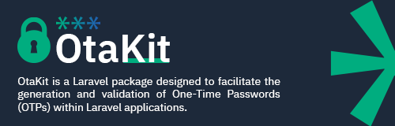

<p align="center"></p>

# Otakit
[](https://packagist.org/packages/digitaltunnel/otakit)

[](https://packagist.org/packages/digitaltunnel/otakit)

OtaKit is a Laravel package designed to facilitate the generation and validation of One-Time Passwords (OTPs) within Laravel applications.


---

## **1. Installation**

You can install the package via Composer:

```bash
composer require digitaltunnel/otakit
```

## **2. Publish Provider**

After installing the package, publish its service provider and configuration file using the following Artisan command:

```bash
php artisan vendor:publish --provider="DigitalTunnel\OtaKit\Providers\OtaKitServiceProvider"
```
This will publish the configuration file (config/otakit.php) to your application's config directory. You can customize the OTP length and expiration time in this file.

## **3. Usage**

### **3.1 Prepare Model**

To use the OtaKit package, you need to add the `Otakit` trait to the model you want to generate OTPs for. This trait provides the necessary methods to generate and validate OTPs.
Model can be any model in your application, such as User, Customer ..., extended from the `Illuminate\Database\Eloquent\Model` class.

```php
    use DigitalTunnel\OtaKit\Traits\Otakit;
    
    class User extends Model
    {
        use Otakit;
    }
```

### **3.2 Generate OTP**

To generate an OTP for an otpable model, use the GenerateOtp action:

```php
    use App\Models\User;

    $user = User::find(1);
    $otp = $user->generateOtp();
```
`generateOtp` can accept two optional parameters: length and ttl. The length parameter specifies the length of the OTP to generate, while the ttl parameter specifies the time to live for the OTP in minutes.

```php
    $otp = $user->generateOtp(length: 6, ttl: 10);
```

or you can use the `generateOtp` action directly:

```php
    use App\Models\Customer;
    use DigitalTunnel\Otakit\Actions\GenerateOtp;
    
    $otpable = Customer::find(1);
    
    $otp = (new GenerateOtp)->handle(
        otpable :$otpable,
        length :4,
        ttl: 5 // Time to live in minutes
    )
```

### **3.3 Validate OTP**

To validate an OTP, use the `validateOtp` method on the otpable model:

```php
    use App\Models\User;

    $user = User::find(1);
    $isValid = $user->validateOtp(
        otp: 123456
    );
```

or you can use the `validateOtp` action directly:

```php
    use App\Models\Customer;
    use DigitalTunnel\Otakit\Actions\ValidateOtp;
    
    $otpable = Customer::find(1);
    
    $isValid = (new ValidateOtp)->handle(
        otpable :$otpable,
        otp: 123456
    )
```

## **4. Listen to Events**

The Otakit package fires events when an OTP is generated and when an OTP is validated. You can listen to these events in your application by adding event listeners to your EventServiceProvider.

```php
    protected $listen = [
        OtpGenerated::class => [
            // you listeners
            // send otp though sms or email or any other channel
            // log the otp generated
            // etc...
        ],
        
        OtpValidationSuccess::class => [
            // you listeners
            // log the otp validation success
            // etc...
        ],
        
        OtpValidationFailed::class => [
            // you listeners
            // log the otp validation failed
            // etc...
        ],
    ];
```


## **5. Tests**

This package is thoroughly tested using Pest. To run the tests, use the following command:

```bash
    ./vendor/bin/pest
```

Test Coverage

    OTP generation and storage.
    OTP verification (valid, invalid, and expired cases).
    Event dispatching for OTP lifecycle events.


## **6. License**
This package is open-source software licensed under the MIT License. See the LICENSE file for more details.


## **Contributing**
Contributions are welcome!.


## **Security Vulnerabilities**
If you discover a security vulnerability within this package, please send an e-mail to [hey@digitaltunnel.net](mailto:hey@digitaltunnel.net). All security vulnerabilities will be promptly addressed.


## **Credits**
This package is developed and maintained by [Digital Tunnel](https://digitaltunnel.net).    


## **Support**
If you encounter any issues or have questions, please open an issue on the GitHub repository.
